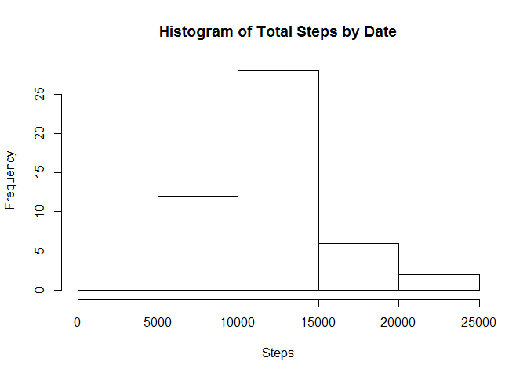
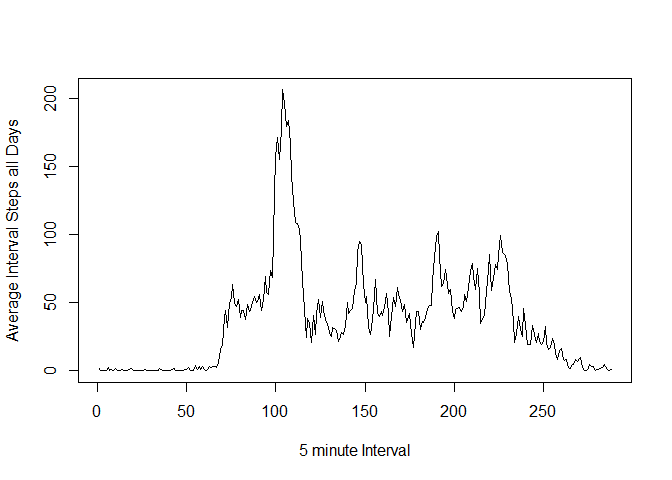
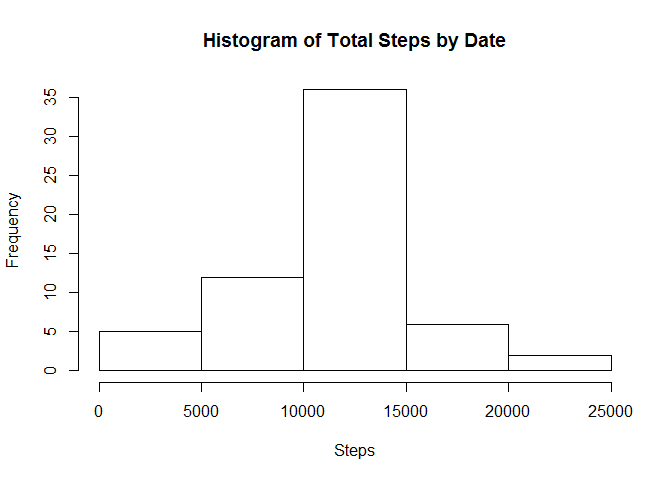
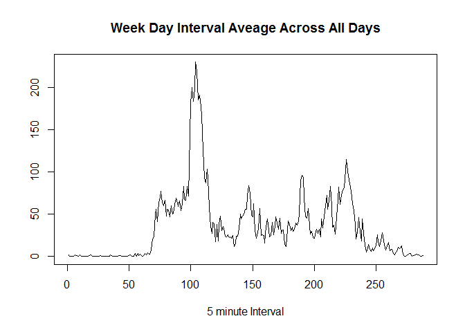
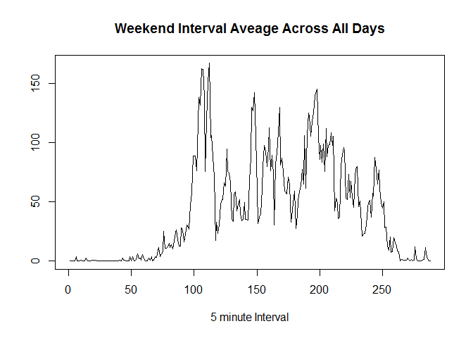

# Reproducible Research: Peer Assessment 1


## Loading and preprocessing the data

```r
setwd("C:/Users/rob/Desktop/Courses/01 - Data Science/05 - Reproducible Research")
activity <- read.csv("./RepData_PeerAssessment1/activity.csv")

#Convert date from factor 
activity$date <- as.Date(activity$date, format="%Y-%m-%d")
```


## What is mean total number of steps taken per day?

```r
####    What is mean total number of steps taken per day####
        #ignore missing values

        #Make a histogram of the total number of steps taken each day
        completeActivity <- activity[complete.cases(activity),]
        totalStepsByDate <- aggregate(steps ~ date, data=completeActivity, rm.na=TRUE, sum)
        hist(totalStepsByDate$steps, xlab="Steps", main="Histogram of Total Steps by Date")
```

 

```r
        #Calculate the mean and median total number of steps taken per day
        summary(totalStepsByDate$steps)        
```

```
##    Min. 1st Qu.  Median    Mean 3rd Qu.    Max. 
##      42    8842   10770   10770   13300   21200
```


## What is the average daily activity pattern?

```r
 #average interval steps all days
        intervalAverage <- aggregate(steps ~ interval, data=activity, mean)
        #time series plot of intervals across all days
        plot(intervalAverage$steps, type="l", xlab="5 minute Interval", 
             ylab="Average Interval Steps all Days")
```

 

```r
        #Which interval contains maximum number of steps
        intervalAverage[which.max(intervalAverage$steps),]
```

```
##     interval    steps
## 104      835 206.1698
```
## Imputing missing values


```r
#Calcualte total No. of missing values in dataset
        nrow(activity[!complete.cases(activity),])
```

```
## [1] 2304
```

```r
        table(is.na(activity$steps))
```

```
## 
## FALSE  TRUE 
## 15264  2304
```

```r
#Take interval average removing NAs
intervalAverageComplete <- aggregate(steps ~ interval, data=activity, rm.na=TRUE, mean)
        #rename variables        
names(intervalAverageComplete) <- sub("steps", "intAverage", names(intervalAverageComplete))
        
#Fill in NAs with interval average from previous step
        #Merge datasets to include inverval average in activity
        activity2 <- merge(activity, intervalAverageComplete, by="interval")
        #replace missing NAs
        activity2$steps[is.na(activity2$steps)] <- activity2$intAverage[is.na(activity2$steps)]
        #drop average column
        activity2 <- activity2[,1:3]

        #4 Make histogram total number of steps each day, calculate mean median,
        #histogram
        totalStepsNewDF <- aggregate(steps ~ date, data=activity2, sum)
        hist(totalStepsNewDF$steps, xlab="Steps", main="Histogram of Total Steps by Date")
```

 

```r
        #calculate mean and median of total No. steps take per day
        summary(totalStepsNewDF$steps)
```

```
##    Min. 1st Qu.  Median    Mean 3rd Qu.    Max. 
##      41    9819   10770   10770   12810   21190
```


## Are there differences in activity patterns between weekdays and weekends?

```r
 #Create new factor variable in dataset for weekend weekday
        activity2$wend <- as.factor(ifelse(weekdays(activity2$date)%in% c("Saturday","Sunday"),"Weekend","Weekday"))  

#calculate average No steps taken per day
#subset weekday/weekend
subsetWeekday <- activity2[activity2$wend=="Weekday",]
subsetWeekend <- activity2[activity2$wend=="Weekend",]
#Calculate inverval average across all days
weekdayStepsAverage <- aggregate(steps ~ interval, data=subsetWeekday, mean)
weekendStepsAverage <- aggregate(steps ~ interval, data=subsetWeekend, mean)

#plot weekday interval average
plot(weekdayStepsAverage$steps, type="l", xlab="5 minute Interval",
        ylab="", main="Week Day Interval Aveage Across All Days")
```

 

```r
#Plot weekend interval average
plot(weekendStepsAverage$steps, type="l", xlab="5 minute Interval",
        ylab="", main="Weekend Interval Aveage Across All Days")
```

 
